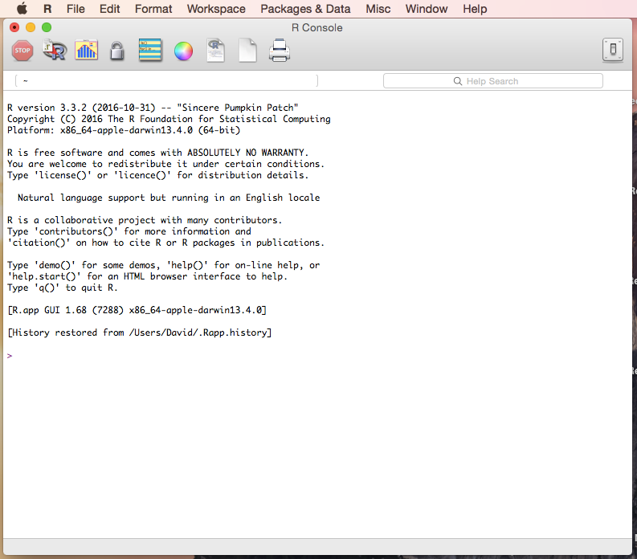
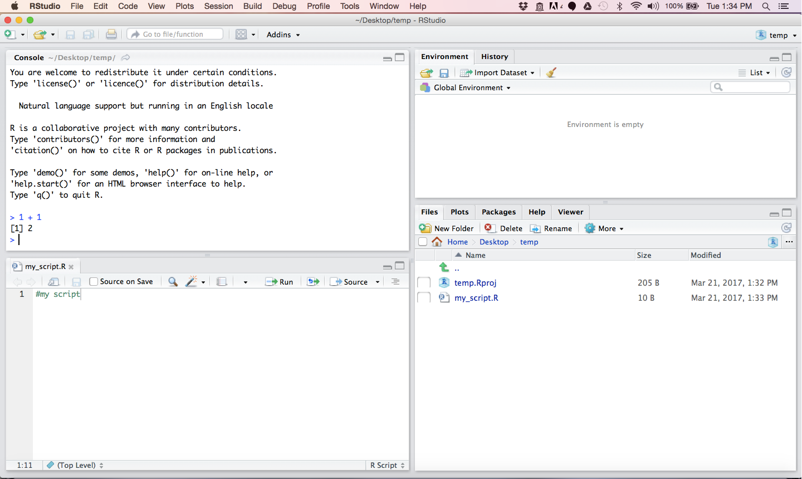

# An introduction to R {#r-intro}

In order to use statistics we need to learn how to writing small computer "programs", which are simply lists of commands that we tell a computer to execute.

Luckily for us, there is a computer programming language that is written specifically for this purpose.  This language has the very imaginative name, [R](https://www.r-project.org/).  The great thing about R is that it is entirely free and a large community works with it creating resources and tools that can be used by all of us.

## Installing R and Rstudio

Before we proceed we need to get a copy of R on our computer.  That can be done simply by downloading the program and following the installation instructions [here](https://cran.r-project.org/mirrors.html).

Once you have R installed you can open it up and see something that looks like this:

```{r R_console, echo=FALSE, fig.height=0.4, fig.width=0.4}

```

Straight away, I am going to suggest using something different that will ultimately make your R experience, and therefore your whole life, much more enjoyable.  That is RStudio, an integrated development environment (IDE).   Essentially all that it is a souped up R console in which you can organize multiple windows to work seamlessly with R.  Trust me.  

Go get yourself a free copy [here](https://www.rstudio.com/).

Once you have installed that it should look liked this:

```{r Rstudio_console, echo=FALSE, fig.height=0.4, fig.width=0.8}

```

And now we are in bussiness

## Using R as a calculator

It is useful to think of R as a calculator in which we can do normal calculations.

Try the following in which we so simple arithmetic such as:

$10 + 10 = 20$ 

```{r}
10 + 10
```

or $10 * 10 = 100$:

```{r}
10 * 10
```


or any other basic calculation we want to do:

```{r, basic_arithmetic}
10 / 10
10 - 10
10 ^2
log(10)
```

as you can see R executes each of the commands and returns an anwswer 

## Using variables

One thing that you will want to do is store the answer so that you can use that again.  The way that we do that is by _assigning_ the result using the synatx `x <- 10`.  If we do this we can then use the symbol `x` for our calculations.

```{r}
x <- 10
x
x + x
x * x
x / x
x - x
x ^2
log(x)
```

This becomes really useful because now we could go back and change x to 100 using `x <- 100` and redo all the calculations without having to write everything out again.

## Bring some external data into R

Oftentimes we'll have some data in a table and want to bring those data into R.  That's easy:

```{r}
class.heights <- read.table(file="files/Heights.txt", header=T)
class.heights
```

These data are stored in something called a dataframe.  In this case the dataframe has two columns and in order to access the data in the second colummn we need to explcitly use its column name with the syntax `class.heights$Height.cm`

```{r}
class.heights$Height.cm
```


## Analyze the data

You are probably already familiar with some statistical concepts.  Even if you aren't you can see how we can work with these data using in built `functions` in R.

```{r}
#what is the average height?
mean(class.heights$Height.cm)

#what is the smallest height?
min(class.heights$Height.cm)

#what is the largest height?
max(class.heights$Height.cm)

#let's do that in one command
range(class.heights$Height.cm)

#what's the median?
median(class.heights$Height.cm)

#what's the variance?
var(class.heights$Height.cm)

#what's the standard deviation
sd(class.heights$Height.cm)
```

## Making a plot

As humans are very visual animals, seeing the data is the best way to get a feel for the data.  R is great at this.

```{r}
#Try plot
plot(class.heights$Height.cm)

#plot a histogram of heights
hist(class.heights$Height.cm)
```

Clearly, a histogram is a much better way of depicting the data.

## Saving the plot and saving everything

With a little bit of work we can make the plot look very nice.

```{r}
hist(class.heights$Height.cm, xlab="height (cm)", main="Distribution of class heights in Human Genetics Class")

```

## Keeping a record of everything using R markdown.

When you start working with R a lot you'll quickly find that you have many files and many graphs and you'll lose track of how things were done.  The solution to this is to keep everything in a single file.  We do that using an R Markdown file.  The procedure is simple:

1. In Rstudio we open a new file using

> File -> New File -> R Mardown...

2. We write our code in _chunks_ using

> Insert -> R

in the pull down menu

3. When we have completed our code we run:

> Knit to HTML

which generated a nice record of everything with the R code and the results of running the R code in one place.  

In fact, R Markdown is so useful I wrote this book using this method.
