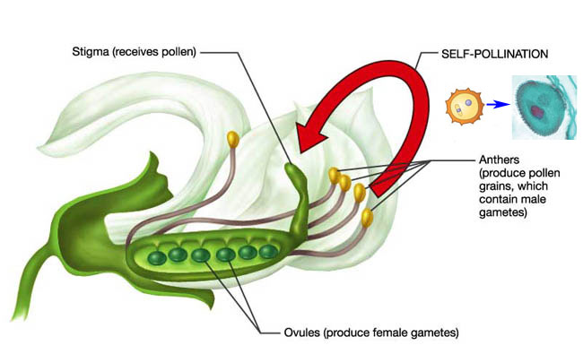

# Mendel's Experiments {#mendel}

```{r mendel, echo=FALSE, fig.height=1, fig.width=1, fig.align='center'}
knitr::include_graphics("images/Mendel.png")
```

The story of the _Monk in the Garden_ has been told many times.  Here, we will focus on what experiments Mendel performed, the resulting data and the model proposed by Mendel.  In the next chapter, we will cover the use of the chi-square test to assess how well the data fits Mendel's model.

## Mendel's monohybrid crosses

The key to Mendel's experiments was the ability to be able to produce progeny by crossing (mating) two individuals _and_ the ability to produce progeny by crossing (mating) an individual to itself.  This is not something that humans, or any mammals, can do.  But, it is something that plants can do. 

```{r pea_selfing, echo=FALSE, fig.align='center', fig.height=5, fig.width=5}

```

## Some key terminology

* __Gene__: a hereditary factor
* __Phenotype__: the form taken by a character
* __Alleles__: the different forms of a gene
* __Dominant__: the allele that dominates (Y allele)
* __Recessive__: the allele that is dominated (y allele)
* __Gametes__: the sperm and egg; contain one allele
* __Zygote__: the fertilized egg
* __Homozygote__: contains a pair of identical alleles
* __Heterozygote__: the pair of alleles differ
* __Genotype__: allelic combinations 
  ** Homozygous recessive (y/y)
  ** Homozygous dominant (Y/Y)
  ** Heterozygous (Y/y)


